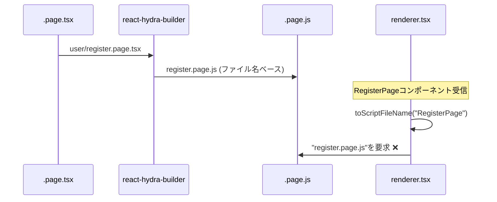

# ビルド時メタデータ埋め込み解決策

## 問題定義

### 現在の問題
react-hydra-builderとDegboxのrendererで発生している名前衝突問題：

```
user/register.page.tsx  → RegisterPage → register.page.js
video/register.page.tsx → RegisterPage → register.page.js ❌衝突
```

**根本原因:**
- react-hydra-builder: ファイル名ベースでビルド
- renderer: コンポーネント名ベースでスクリプトファイルを推測
- この2つのアプローチに不整合がある

### 現在の処理フロー



## 解決策: ビルド時メタデータ埋め込み

### 基本アプローチ

ビルド時に各コンポーネントに元のファイルパス情報を埋め込み、ランタイムでそれを参照して正しいJSファイルを特定する。

### 技術設計

#### 1. ビルド時メタデータ注入

```typescript
// ビルド前: user/register.page.tsx
export default function RegisterPage() {
  return <div>Register</div>;
}

// ビルド後: 自動生成されるJSファイル内
import React from "react";
import { hydrateRoot } from "react-dom/client";
import Page from "./user/register.page.tsx";

// メタデータをグローバルに注入
window.__HYDRA_META__ = window.__HYDRA_META__ || {};
window.__HYDRA_META__["RegisterPage"] = {
  scriptPath: "/public/js/user-register.page.js",
  originalPath: "user/register.page.tsx",
  componentName: "RegisterPage"
};

hydrateRoot(
    document.getElementById("app"),
    <Page {...window.__SERVER_DATA__} />
);
```

#### 2. esbuildプラグイン実装

```typescript
// src/plugins/metadata-injector.ts
import type { Plugin } from 'esbuild';
import { relative, dirname } from 'node:path';

export function createMetadataInjectorPlugin(
  buildTargetDir: string,
  outputDir: string,
  suffix: string
): Plugin {
  return {
    name: 'metadata-injector',
    setup(build) {
      build.onLoad({ filter: /\.tsx?$/ }, async (args) => {
        const originalPath = args.path;
        const relativePath = relative(buildTargetDir, originalPath);
        
        // コンポーネント名を抽出
        const componentName = extractComponentName(originalPath);
        
        // 出力JSファイルパス
        const scriptPath = toScriptPath(outputDir, originalPath, suffix);
        
        // メタデータ注入
        const metadata = {
          scriptPath,
          originalPath: relativePath,
          componentName
        };
        
        return {
          contents: `
            ${await readFile(originalPath, 'utf8')}
            
            // メタデータ埋め込み
            if (typeof window !== 'undefined') {
              window.__HYDRA_META__ = window.__HYDRA_META__ || {};
              window.__HYDRA_META__["${componentName}"] = ${JSON.stringify(metadata)};
            }
          `,
          loader: 'tsx'
        };
      });
    }
  };
}
```

#### 3. TERMPLATEの拡張

```typescript
// src/index.ts
const TEMPLATE = `
import React from "react";
import { hydrateRoot } from "react-dom/client";
import Page from "./%s";

// メタデータレジストリの初期化
if (typeof window !== 'undefined') {
  window.__HYDRA_META__ = window.__HYDRA_META__ || {};
}

// ページ固有のメタデータを登録
const COMPONENT_NAME = "%s"; // ビルド時に注入
const SCRIPT_PATH = "%s";    // ビルド時に注入
const ORIGINAL_PATH = "%s";  // ビルド時に注入

if (typeof window !== 'undefined') {
  window.__HYDRA_META__[COMPONENT_NAME] = {
    scriptPath: SCRIPT_PATH,
    originalPath: ORIGINAL_PATH,
    componentName: COMPONENT_NAME
  };
}

hydrateRoot(
    document.getElementById("app"),
    <Page {...window.__SERVER_DATA__} />
);
`;
```

#### 4. renderer側での動的解決

```typescript
// renderer.tsx
declare global {
  interface Window {
    __HYDRA_META__?: Record<string, {
      scriptPath: string;
      originalPath: string;
      componentName: string;
    }>;
    __SERVER_DATA__?: any;
  }
}

async function render(
  c: Context,
  page: React.ReactElement,
  options?: { title: string },
) {
  const componentName = 
    typeof page.type === "function" && page.type.name
      ? page.type.name
      : "default";

  // サーバーサイドでのメタデータ解決
  const scriptFileName = await resolveScriptPath(componentName);

  c.header("Content-Type", "text/html; charset=utf-8");

  return stream(c, async (stream) => {
    // ...既存のレンダリングロジック...
    
    bootstrapScripts: [`/public/js/${scriptFileName}`],
    bootstrapScriptContent: `
      window.__SERVER_DATA__ = ${JSON.stringify(page.props)};
      // メタデータの事前準備
      window.__HYDRA_META__ = window.__HYDRA_META__ || {};
    `,
  });
}

// サーバーサイドでのスクリプトパス解決
async function resolveScriptPath(componentName: string): Promise<string> {
  // 1. 設定ファイルまたはビルド時生成されたメタデータファイルから解決
  const metadataPath = './build/metadata.json';
  
  try {
    const metadata = JSON.parse(await readFile(metadataPath, 'utf8'));
    const componentMeta = metadata[componentName];
    
    if (componentMeta) {
      return componentMeta.scriptFileName;
    }
  } catch (error) {
    console.warn('メタデータファイルの読み込みに失敗:', error);
  }
  
  // 2. フォールバック: 従来の命名規則
  return toScriptFileName(componentName) + '.page.js';
}
```

#### 5. ビルド時メタデータファイル生成

```typescript
// src/metadata-generator.ts
interface ComponentMetadata {
  [componentName: string]: {
    scriptFileName: string;
    originalPath: string;
    outputPath: string;
  };
}

export async function generateMetadataFile(
  buildTargetDir: string,
  outputDir: string,
  suffix: string
): Promise<void> {
  const files = await readFiles(buildTargetDir, suffix);
  const metadata: ComponentMetadata = {};
  
  for (const file of files) {
    const componentName = extractComponentName(file);
    const relativePath = relative(buildTargetDir, file);
    const scriptFileName = toScriptFileName(file, suffix);
    
    metadata[componentName] = {
      scriptFileName,
      originalPath: relativePath,
      outputPath: `${outputDir}/${scriptFileName}`
    };
  }
  
  // メタデータファイルを生成
  await writeFile(
    './build/metadata.json',
    JSON.stringify(metadata, null, 2)
  );
  
  console.log(`メタデータファイルを生成しました: ${Object.keys(metadata).length}件`);
}
```

### 実装例: 完全な処理フロー

#### ステップ1: ビルド時

```typescript
// 修正された build 関数
export async function build({ 
  buildTargetDir, 
  buildTargetFileSuffix, 
  outputDir 
}: PageBuildConfig): Promise<void> {
  const files = await readFiles(buildTargetDir, buildTargetFileSuffix);
  
  // 1. メタデータ収集
  const metadata: ComponentMetadata = {};
  
  const processes = files.map(async (file) => {
    const componentName = extractComponentName(file);
    const scriptFileName = toScriptFileName(file, buildTargetFileSuffix);
    
    metadata[componentName] = {
      scriptFileName,
      originalPath: relative(buildTargetDir, file),
      outputPath: `${outputDir}/${scriptFileName}`
    };
    
    return _build(outputDir, buildTargetFileSuffix, file, componentName);
  });
  
  await Promise.all(processes);
  
  // 2. メタデータファイル生成
  await generateMetadataFile(metadata);
}

// 修正された _build 関数
async function _build(
  targetDir: string,
  targetFileSuffix: string,
  path: string,
  componentName: string
): Promise<void> {
  const importPath = `./${relative(".", path).replace(/\\/g, "/")}`;
  const outFile = toOutFile(targetDir, path, targetFileSuffix);
  const scriptFileName = basename(outFile);
  
  await esbuild.build({
    stdin: {
      contents: format(TEMPLATE, 
        importPath,
        componentName,
        `/public/js/${scriptFileName}`,
        relative(".", path)
      ),
      resolveDir: ".",
      loader: "tsx",
    },
    bundle: true,
    outfile: outFile,
    platform: "browser",
  });
}
```

#### ステップ2: ランタイム解決

```typescript
// renderer.tsx での完全な実装
class ComponentResolver {
  private static metadata: ComponentMetadata | null = null;
  
  static async loadMetadata(): Promise<void> {
    if (!this.metadata) {
      try {
        const metadataContent = await readFile('./build/metadata.json', 'utf8');
        this.metadata = JSON.parse(metadataContent);
      } catch (error) {
        console.warn('メタデータの読み込みに失敗しました:', error);
        this.metadata = {};
      }
    }
  }
  
  static async resolveScriptPath(componentName: string): Promise<string> {
    await this.loadMetadata();
    
    const componentMeta = this.metadata?.[componentName];
    if (componentMeta) {
      return componentMeta.scriptFileName;
    }
    
    // フォールバック
    console.warn(`コンポーネント ${componentName} のメタデータが見つかりません`);
    return toScriptFileName(componentName) + '.page.js';
  }
}

// render関数での使用
async function render(
  c: Context,
  page: React.ReactElement,
  options?: { title: string },
) {
  const componentName = 
    typeof page.type === "function" && page.type.name
      ? page.type.name
      : "default";

  const scriptFileName = await ComponentResolver.resolveScriptPath(componentName);
  
  // ... 残りの実装
}
```

## メリット・デメリット分析

### メリット

1. **確実性**: ファイルパスとコンポーネント名の完全な対応
2. **柔軟性**: 複雑なディレクトリ構造にも対応
3. **保守性**: メタデータファイルで関係性が可視化
4. **拡張性**: 将来的な機能追加が容易
5. **デバッグ性**: メタデータでトレーサビリティが向上

### デメリット

1. **複雑性**: 実装が他の案より複雑
2. **ビルド時間**: メタデータ生成のオーバーヘッド
3. **ファイル増加**: メタデータファイルの管理が必要
4. **依存性**: メタデータファイルへの依存

### 他の案との比較

| 項目 | 案1(ディレクトリ保持) | 案2(パス含めファイル名) | 案3(メタデータ埋め込み) |
|------|------------------------|------------------------|-------------------------|
| 実装複雑度 | 低 | 低 | 高 |
| 確実性 | 高 | 高 | 最高 |
| 柔軟性 | 中 | 低 | 最高 |
| パフォーマンス | 高 | 高 | 中 |
| 保守性 | 高 | 中 | 高 |

## 移行計画

### フェーズ1: 基盤実装 (1-2週間)
1. メタデータ生成機能の実装
2. ComponentResolverクラスの実装
3. 基本的なメタデータ埋め込み機能

### フェーズ2: 統合テスト (1週間)
1. 既存のコンポーネントでの動作確認
2. 名前衝突ケースのテスト
3. パフォーマンス測定

### フェーズ3: 本格運用 (1週間)
1. 本番環境での段階的導入
2. モニタリングとログ分析
3. フォールバック機能の検証

### 段階的実装アプローチ

```typescript
// 互換性を保った実装
async function resolveScriptPath(componentName: string): Promise<string> {
  // 新方式を試行
  try {
    const metadataPath = await ComponentResolver.resolveScriptPath(componentName);
    if (metadataPath) {
      return metadataPath;
    }
  } catch (error) {
    console.warn('新方式での解決に失敗:', error);
  }
  
  // フォールバック: 既存方式
  return toScriptFileName(componentName) + '.page.js';
}
```

## 推奨事項

1. **段階的導入**: 既存システムとの互換性を保ちながら導入
2. **監視体制**: メタデータ解決の成功率をモニタリング
3. **文書化**: メタデータスキーマとAPIの詳細文書化
4. **テスト戦略**: エッジケースを含む包括的なテストスイート

この解決策により、react-hydra-builderとDegboxのrendererの間でファイルパス解決の確実性と柔軟性を大幅に向上できます。